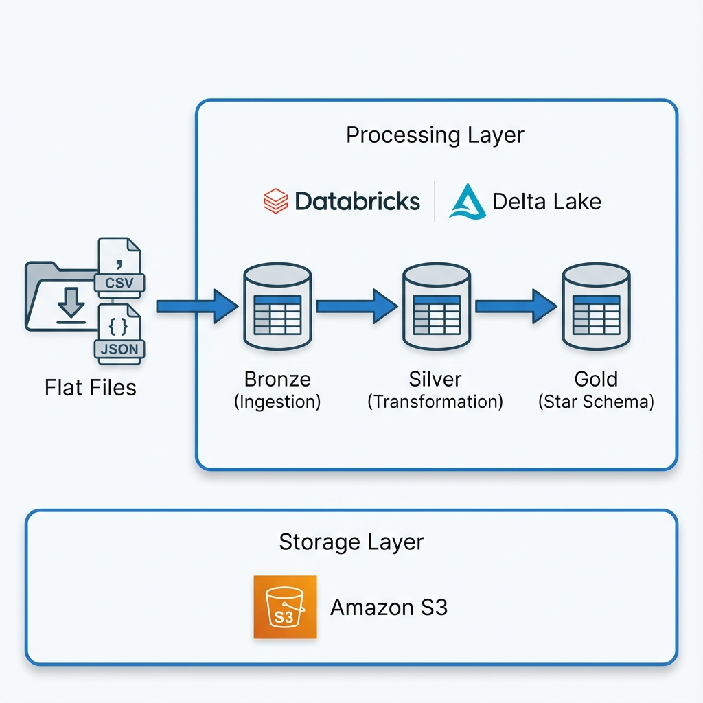

# R2DE Databricks Project - Medallion Architecture

## Overview

Developed as part of the **Road to Data Engineer Bootcamp**, this project implements a Data Engineering pipeline using the **Medallion Architecture** (Bronze, Silver, Gold) on **Databricks Free Edition**. It demonstrates an end-to-end ETL process that ingests raw data from Amazon S3, performs data cleaning and transformation using PySpark, and models the data into a Star Schema for business analytics.


### Architecture Diagram



## Features

*   **Infrastructure Management**: Automates the setup of Databricks Unity Catalog, creating a dedicated catalog (`r2de_project`) and schemas for each layer (`bronze`, `silver`, `gold`).
*   **Bronze Layer (Ingestion)**:
    *   Ingests raw data from S3 (CSV and JSON formats).
    *   Loads data into Delta Tables with raw schema preservation.
    *   Handles multiple data entities: Customer, Product, Transaction, and Currency.
*   **Silver Layer (Transformation)**:
    *   **Data Cleaning**: Renames columns to snake_case, removes null values (e.g., missing `customer_id`), and deduplicates records.
    *   **Type Casting**: Converts data types (e.g., String to Integer/Double, Date parsing) for consistency.
    *   **Business Logic**: Standardizes currency rates and formats dates.
*   **Gold Layer (Star Schema)**:
    *   **Dimensional Modeling**: Creates Dimension tables (`dim_customer`, `dim_product`) and Fact tables (`fact_sales`).
    *   **Enrichment**: Joins transaction data with currency rates to calculate sales amounts in local currency (THB).
    *   **Analytics**: Provides sample queries for business insights, such as total sales by country and product.

## Project Structure

```plaintext
.
├── data/
│   ├── currency.json          # Raw currency data
│   ├── customer.csv           # Raw customer data
│   ├── product.csv            # Raw product data
│   └── transaction.csv        # Raw transaction data
├── notebooks/
│   ├── 00_Setup_Infrastructure.ipynb  # Sets up Catalog and Databases
│   ├── 01_Bronze_Ingestion.ipynb      # Ingests raw data from S3 to Bronze Delta tables
│   ├── 02_Silver_Transformation.ipynb # Cleans and transforms data to Silver layer
│   └── 03_Gold_Star_Schema.ipynb      # Models data into Gold Star Schema
└── README.md                          # This file
```

## Setup Instructions

### Prerequisites

*   **Databricks Workspace**: A running **Databricks Free Edition** workspace.
*   **Amazon S3 Bucket**: An S3 bucket to store raw data and Delta tables.

### Installation & Configuration

1.  **Clone the Repository:**
    Import this repository into your Databricks Workspace.

2.  **Prepare Data in S3:**
    Upload the raw data files from the local `data/` folder to your S3 bucket under the `raw/` directory:
    *   `s3://<your-bucket>/raw/customer.csv`
    *   `s3://<your-bucket>/raw/product.csv`
    *   `s3://<your-bucket>/raw/transaction.csv`
    *   `s3://<your-bucket>/raw/currency.json`

3.  **Update Configuration:**
    Open the notebooks and update the `s3_bucket` variable to match your S3 bucket name:
    ```python
    s3_bucket = "s3://your-bucket-name"
    ```

## Usage

Run the notebooks in the following order to execute the pipeline:

1.  **00_Setup_Infrastructure.ipynb**:
    *   Run this first to create the `r2de_project` catalog and the `bronze`, `silver`, and `gold` databases.
    *   *Note: Ensure you have permissions to create catalogs.*

2.  **01_Bronze_Ingestion.ipynb**:
    *   Reads raw CSV/JSON files from S3.
    *   Writes data to the Bronze layer (`r2de_project.bronze`) as Delta tables.

3.  **02_Silver_Transformation.ipynb**:
    *   Reads from the Bronze layer.
    *   Performs cleaning, renaming, and type casting.
    *   Writes clean data to the Silver layer (`r2de_project.silver`).

4.  **03_Gold_Star_Schema.ipynb**:
    *   Reads from the Silver layer.
    *   Creates `dim_customer`, `dim_product`, and `fact_sales`.
    *   Calculates `sales_amount_thb` using exchange rates.
    *   Writes the final model to the Gold layer (`r2de_project.gold`).
    *   Run the sample query at the end to view analytics results.

## Data Flow

1.  **Raw (S3)** -> **Bronze (Delta)**: Raw ingestion.
2.  **Bronze** -> **Silver (Delta)**: Cleaned and standardized.
3.  **Silver** -> **Gold (Delta)**: Star Schema for analytics and reporting.
